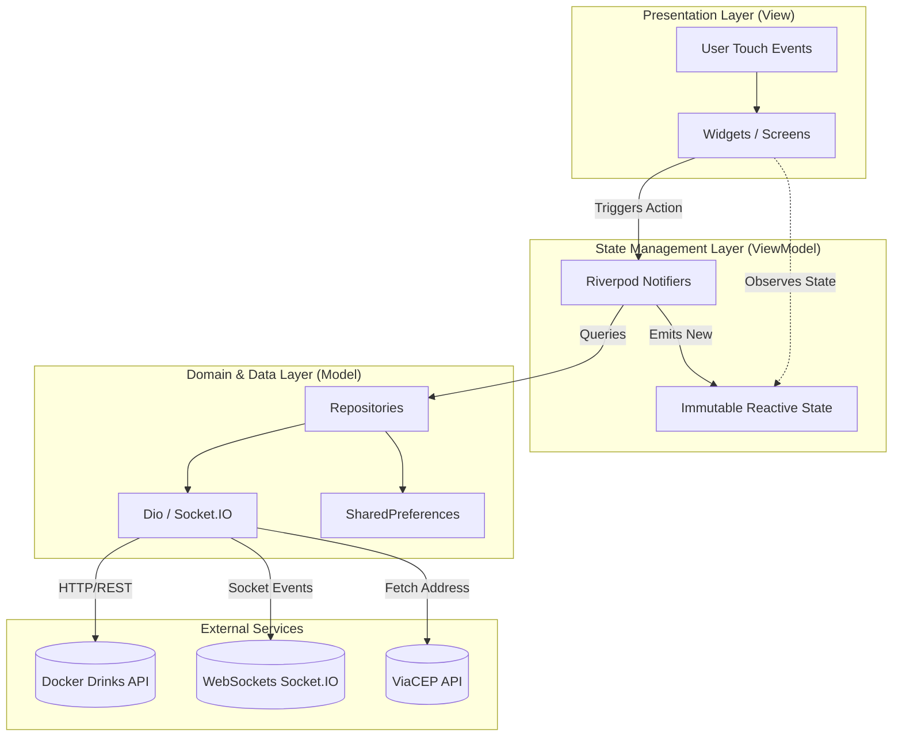

# 🍺 Docker Drinks — Mobile App (Flutter)

[](https://flutter.dev/)
[](https://dart.dev/)
[](https://riverpod.dev/)
[](https://pub.dev/packages/dio)
[](https://socket.io/)
[](https://pub.dev/packages/go_router)
[](https://opensource.org/licenses/MIT)

> 🇧🇷 [**Português**](README.md) | 🇺🇸 **English Version**

Modern native Flutter mobile application for beverage delivery featuring role-based JWT authentication (Customer, Seller, Administrator), interactive catalog with real-time search and category filtering, reactive shopping cart state management with Riverpod, ViaCEP integration for automatic address lookup, and real-time delivery order tracking powered by WebSockets.

## 📌 Quick Navigation

- [📝 About the Project](#-about-the-project)
- [👥 Project Origin & Legacy](#-project-origin--legacy)
- [🖼️ Preview](#️-preview)
- [⚡ API Endpoints](#-api-endpoints)
- [✨ Key Features](#-key-features)
- [🛠️ Technologies & Tools](#️-technologies--tools)
- [🏛️ Solution Architecture](#️-solution-architecture)
- [📁 Repository Structure](#-repository-structure)
- [💡 Technical Decisions](#-technical-decisions)
- [🚀 How to Run the Project](#-how-to-run-the-project)
- [📄 License](#-license)

## 📝 About the Project

**Docker Drinks Mobile** is a complete e-commerce and delivery logistics solution developed in Flutter to transform a legacy web interface into a 100% native, smooth, and responsive mobile application.

The project was crafted following a **Feature-First** structure combined with the **MVVM (Model-View-ViewModel)** architectural pattern using **Riverpod**, ensuring strict separation of concerns, high testability, and long-term maintainability. It communicates directly with a production RESTful backend and consumes real-time WebSocket events for instant order status transitions.

## 👥 Project Origin & Legacy

This mobile application is an evolution and native mobile port built upon the original web application project available at:  
🔗 [**ludson96/project-delivery-app**](https://github.com/ludson96/project-delivery-app)

### 🔄 From Web to Native Mobile
- **Original Web Project**: Built originally as a full-stack browser web application (React on the front-end, Node.js/Express and Sequelize on the backend), establishing the business logic, role-based workflows (Customer, Seller, and Admin), and the delivery order lifecycle.
- **Mobile Evolution**: Leveraging the core ecosystem and production REST/WebSocket backend, this repository reimagines and rebuilds the end-to-end customer and merchant experience as a modern native Flutter app — delivering fluid animations, haptic tactile response, smart postal lookup via ViaCEP, and responsive native UI components for Android and iOS.

## 🖼️ Preview


## ⚡ API Endpoints

The application consumes the official Docker Drinks API hosted in production:  
`https://docker-drinks-api.onrender.com`

| Method | Route | Auth / Role | Description |
| :--- | :--- | :--- | :--- |
| `POST` | `/login` | Public | User credential authentication issuing JWT token and profile data |
| `POST` | `/register` | Public | Self-registration for new customers |
| `GET` | `/products` | Public | Beverage catalog with names, prices, and image URLs |
| `POST` | `/sales` | `Bearer Token` (Customer) | Order placement with delivery address, house number, and items |
| `GET` | `/sales` | `Bearer Token` (All) | Order history list filtered by user role and identity |
| `PATCH` | `/sales/:id/status` | `Bearer Token` (Seller) | Order status transition with WebSocket broadcast |
| `GET` | `/admin/manager` | `Bearer Token` (Admin) | Consolidated list of all registered ecosystem users |
| `GET` | `/health` | Public | Backend server health check and uptime status |

## ✨ Key Features

### 👤 Customer Experience
- **Secure Authentication**: Login and registration with field validation, prominent inline error banners, and local JWT token persistence.
- **Smart Catalog**: Beverage grid with cached images (`CachedNetworkImage`), real-time search query filtering, and horizontal category chips (*All*, *Cans*, *Long Necks*, *Bottles*).
- **Shimmer Skeleton Loading**: Fluid pulsating skeleton cards displayed during initial network fetch.
- **Reactive Shopping Cart**: Elastic animated badge counter in the AppBar, quantity controls (+ / -) with native haptic feedback, and dynamic subtotal calculations.
- **Smart Checkout**: ViaCEP integration for instant ZIP code lookup, auto-populating street, neighborhood, and city fields.
- **Order Tracking**: Detailed purchase history and interactive delivery progress timeline (`Pending` ➔ `Preparing` ➔ `In Transit` ➔ `Delivered`).
- **Real-Time WebSockets**: Instant delivery status updates without manual pull-to-refresh (`Socket.IO`).

### 🚚 Seller Experience
- **Logistics Overview**: Centralized view of all sales assigned to the distribution center.
- **Order Flow Control**: Direct actions to advance delivery stages seamlessly.

### ⚙️ Administrator Experience
- **User Governance**: Consolidated overview of all users with visible role badges (`customer`, `seller`, `administrator`).

## 🛠️ Technologies & Tools

| Layer / Purpose | Technology | Description |
| :--- | :--- | :--- |
| **Primary Language** | **Dart 3.10+** | Strong static typing, sound null-safety, and compiled high performance |
| **Mobile Framework** | **Flutter 3.x** | Multiplatform native rendering engine running at 60/120 FPS |
| **State Management** | **Flutter Riverpod 2.5** | Declarative, immutable, context-independent, and compile-safe state architecture |
| **Navigation & Routing** | **GoRouter 14.x** | Declarative URL-based routing with route guards and deep-linking support |
| **HTTP Client** | **Dio 5.4** | RESTful network requests with automated interceptors for JWT Bearer tokens |
| **Real-Time Engine** | **Socket.IO Client 3.0** | Bidirectional WebSockets listening for order status update events |
| **Local Storage** | **SharedPreferences 2.2** | On-device persistent storage for user credentials and session tokens |
| **Styling & Typography** | **Google Fonts (Inter)** | Refined design system with Material 3 styling and brand color palette |
| **Image Caching** | **CachedNetworkImage 3.4** | Network image caching ensuring fast loads and reduced bandwidth |
| **Localization & Currency** | **Intl 0.19** | Brazilian currency (`R$`) and Portuguese date formatters |
| **Automated Testing** | **Flutter Test** | Unit tests covering shopping cart business logic and calculations |

## 🏛️ Solution Architecture

The application adopts a **Feature-First** structure combined with the **MVVM (Model-View-ViewModel)** architectural pattern via **Flutter Riverpod**:



## 📁 Repository Structure

```text
delivery_app/
├── assets/
│   └── images/                     # Official brand logo, background, and icons
├── lib/
│   ├── core/                       # Core cross-cutting modules
│   │   ├── constants/              # API endpoints and storage keys
│   │   ├── network/                # Dio client with JWT interceptor
│   │   ├── services/               # ViaCEP address resolution service
│   │   ├── storage/                # SharedPreferences local service
│   │   ├── theme/                  # Design System, colors, and Inter typography
│   │   ├── utils/                  # Currency (BRL) and date formatters
│   │   └── widgets/                # Shimmer skeleton loader and reusable widgets
│   ├── features/                   # Feature-First domain modules (Internal MVVM)
│   │   ├── admin/                  # User governance and access management
│   │   │   ├── models/
│   │   │   ├── repositories/
│   │   │   ├── viewmodels/
│   │   │   └── views/
│   │   ├── auth/                   # Authentication (Login and Registration)
│   │   │   ├── models/
│   │   │   ├── repositories/
│   │   │   ├── viewmodels/
│   │   │   └── views/
│   │   ├── cart/                   # Reactive shopping cart
│   │   │   ├── models/
│   │   │   └── viewmodels/
│   │   ├── catalog/                # Beverage catalog with real-time filters
│   │   │   ├── models/
│   │   │   ├── repositories/
│   │   │   ├── viewmodels/
│   │   │   └── views/
│   │   ├── checkout/               # Address lookup and order placement
│   │   │   ├── models/
│   │   │   ├── repositories/
│   │   │   ├── viewmodels/
│   │   │   └── views/
│   │   └── orders/                 # Order history & real-time WebSocket tracking
│   │       ├── models/
│   │       ├── repositories/
│   │       ├── services/
│   │       ├── viewmodels/
│   │       └── views/
│   ├── routes/                     # Centralized GoRouter configuration
│   │   └── app_router.dart
│   └── main.dart                   # Async bootstrap and ProviderScope
└── test/                           # Unit tests
    ├── cart_viewmodel_test.dart
    └── widget_test.dart
```

## 💡 Technical Decisions

- **Feature-First Architecture**: Code grouped by business domains rather than generic technical layer folders. Simplifies navigation, isolates feature changes, and mirrors real-world production codebases.
- **MVVM Pattern with Riverpod**: Clear separation between business rules and UI widgets. Views remain dumb widgets while ViewModels handle asynchronous state, loading, and error handling without depending on `BuildContext`.
- **Declarative Route Guards**: `GoRouter` evaluates the authentication state in real time; unauthenticated attempts to enter protected areas immediately redirect to Login.
- **Defensive Navigation**: Implementation of `context.canPop()` checks with automated fallback to `/catalog` on back buttons to prevent empty stack runtime exceptions.
- **Real-Time WebSockets**: Persistent `socket_io_client` connection delivering delivery milestone transitions to the customer interface instantaneously.

## 🚀 How to Run the Project

### Prerequisites
- [Flutter SDK](https://docs.flutter.dev/get-started/install) installed (version 3.10 or higher)
- Compatible [Dart SDK](https://dart.dev/get-dart)
- Physical device or Android Emulator / iOS Simulator

### Step by Step

1. **Clone the repository:**
   ```bash
   git clone https://github.com/ludson96/delivery_app.git
   cd delivery_app
   ```

2. **Install dependencies:**
   ```bash
   flutter pub get
   ```

3. **Run unit tests:**
   ```bash
   flutter test
   ```

4. **Run static code analysis (Linter):**
   ```bash
   flutter analyze
   ```

5. **Start the application:**
   ```bash
   flutter run
   ```

### 🔑 Pre-configured Test Credentials:

| Role | E-mail | Password |
| :--- | :--- | :--- |
| **Customer** | `zebirita@email.com` | `$#zebirita#$` |
| **Administrator** | `adm@deliveryapp.com` | `--adm2022--` |
| **Seller** | `fulana@deliveryapp.com` | `fulana@123` |

## 📄 License

This project is licensed under the terms of the [MIT](LICENSE) License.

<div align="center">
  Developed by <strong>Ludson Pereira dos Santos</strong> 🚀<br />
  <a href="https://www.linkedin.com/in/ludson96/">LinkedIn</a> • <a href="https://github.com/ludson96">GitHub</a> • <a href="mailto:ludson_ps27@hotmail.com">E-mail</a>
</div>
