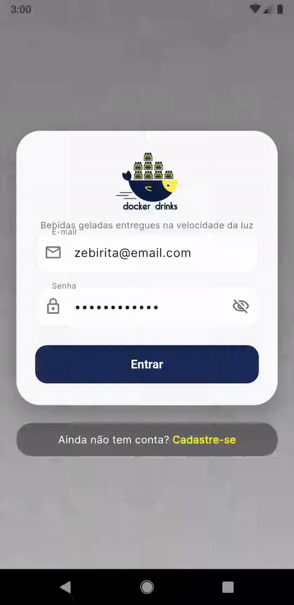
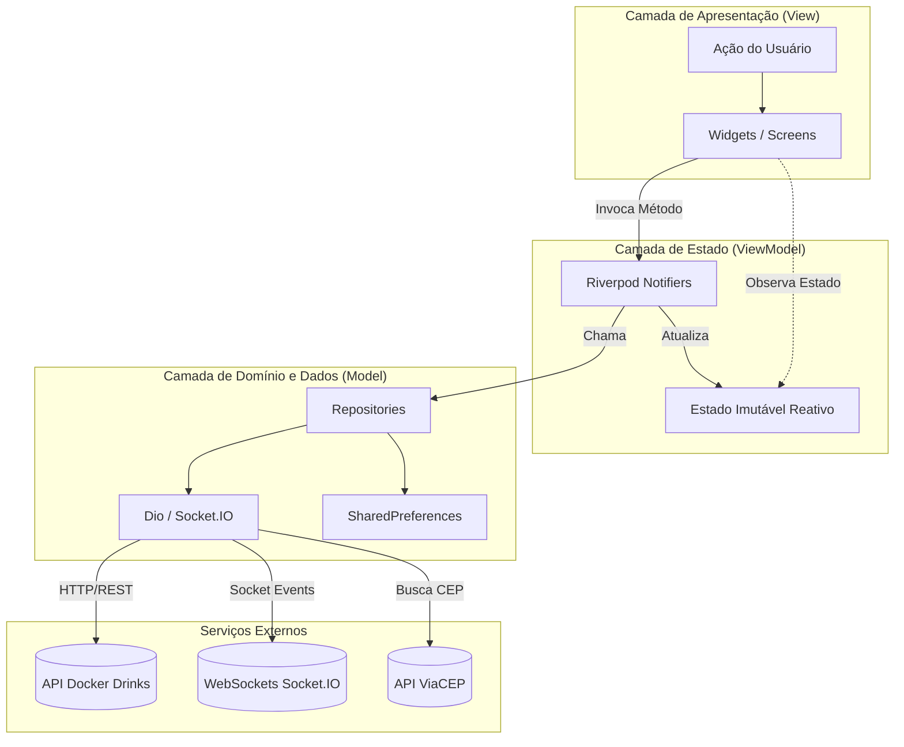

# 🍺 Docker Drinks — Mobile App (Flutter)

[](https://flutter.dev/)
[](https://dart.dev/)
[](https://riverpod.dev/)
[](https://pub.dev/packages/dio)
[](https://socket.io/)
[](https://pub.dev/packages/go_router)
[](https://opensource.org/licenses/MIT)

> 🇧🇷 **Português** | 🇺🇸 [**English Version**](README.en.md)

Aplicativo mobile nativo em Flutter para delivery de bebidas com autenticação JWT baseada em papéis (Cliente, Vendedor, Administrador), catálogo interativo com busca em tempo real e filtros por categoria, carrinho de compras com gerenciamento reativo de estado via Riverpod, integração com ViaCEP para preenchimento de endereço e acompanhamento de status de entregas em tempo real com WebSockets.

## 📌 Navegação Rápida

- [📝 Sobre o Projeto](#-sobre-o-projeto)
- [🖼️ Preview](#️-preview)
- [⚡ API Endpoints](#-api-endpoints)
- [✨ Funcionalidades](#-funcionalidades)
- [🛠️ Tecnologias e Ferramentas Utilizadas](#️-tecnologias-e-ferramentas-utilizadas)
- [🏛️ Arquitetura da Solução](#️-arquitetura-da-solução)
- [📁 Estrutura do Repositório](#-estrutura-do-repositório)
- [💡 Decisões Técnicas](#-decisões-técnicas)
- [🚀 Como Executar o Projeto](#-como-executar-o-projeto)
- [📄 Licença](#-licença)

## 📝 Sobre o Projeto

O **Docker Drinks Mobile** é uma solução completa de e-commerce e logística de entregas desenvolvida em Flutter para transformar a experiência web legada em um aplicativo móvel 100% nativo, fluido e responsivo.

O projeto foi concebido seguindo a organização **Feature-First** combinada com a arquitetura de software **MVVM (Model-View-ViewModel)** via **Riverpod**, garantindo separação clara de responsabilidades, testabilidade e manutenibilidade. Ele se comunica diretamente com a API RESTful em produção e consome eventos via WebSocket para garantir atualizações instantâneas de status de pedidos.

## 🖼️ Preview



## ⚡ API Endpoints

O aplicativo consome a API oficial do Docker Drinks hospedada em produção:  
`https://docker-drinks-api.onrender.com`

| Método | Rota | Autenticação / Role | Descrição |
| :--- | :--- | :--- | :--- |
| `POST` | `/login` | Pública | Autenticação de credenciais com retorno de token JWT e dados do usuário |
| `POST` | `/register` | Pública | Cadastro autônomo de novos clientes |
| `GET` | `/products` | Pública | Catálogo de bebidas com nomes, preços e URLs de imagens |
| `POST` | `/sales` | `Bearer Token` (Cliente) | Criação de novos pedidos com endereço, número e itens selecionados |
| `GET` | `/sales` | `Bearer Token` (Todos) | Listagem do histórico de pedidos filtrados pelo papel do usuário |
| `PATCH` | `/sales/:id/status` | `Bearer Token` (Vendedor) | Alteração de status do pedido transmitida via WebSocket |
| `GET` | `/admin/manager` | `Bearer Token` (Admin) | Listagem consolidada de todos os usuários do ecossistema |
| `GET` | `/health` | Pública | Checagem de disponibilidade do servidor backend |

## ✨ Funcionalidades

### 👤 Painel do Cliente (Customer)
- **Autenticação Segura**: Login e cadastro com validação de campos, mensagens de erro em banners inline e persistência local do token JWT.
- **Catálogo Inteligente**: Grid de bebidas com fotos em cache (`CachedNetworkImage`), barra de busca reativa em tempo real e filtros horizontais por tipo (*Todas*, *Latas*, *Long Necks*, *Garrafas*).
- **Shimmer Skeleton Loading**: Feedback visual pulsante e agradável durante o carregamento inicial dos produtos.
- **Carrinho Reativo**: Contador de itens dinâmico com micro-animação elástica na AppBar, badge numérico e controle preciso de quantidades (+ / -) com feedback háptico.
- **Checkout Inteligente**: Integração com a API do ViaCEP para autopreenchimento de Rua, Bairro e Cidade a partir do CEP informado.
- **Acompanhamento de Entregas**: Histórico de compras e tela de detalhes com timeline visual do progresso da entrega (`Pendente` ➔ `Preparando` ➔ `Em Trânsito` ➔ `Entregue`).
- **Tempo Real com WebSockets**: Atualização imediata do status na tela sem necessidade de recarregar o app (`Socket.IO`).

### 🚚 Painel do Vendedor (Seller)
- **Visão Logística**: Listagem das vendas direcionadas à distribuidora.
- **Transição de Etapas**: Ações diretas para avançar o status das entregas.

### ⚙️ Painel do Administrador (Admin)
- **Governança de Usuários**: Visualização de todos os usuários cadastrados e identificação visual de permissões (`customer`, `seller`, `administrator`).

## 🛠️ Tecnologias e Ferramentas Utilizadas

| Camada / Finalidade | Tecnologia | Descrição |
| :--- | :--- | :--- |
| **Linguagem Principal** | **Dart 3.10+** | Tipagem estática rigorosa, Null Safety e alta performance compilada |
| **Framework Mobile** | **Flutter 3.x** | Interface de usuário multiplataforma de renderização nativa de 60/120 FPS |
| **Gerenciamento de Estado** | **Flutter Riverpod 2.5** | Estado declarativo, imutável, desacoplado de contexto e compile-safe |
| **Navegação & Rotas** | **GoRouter 14.x** | Roteamento declarativo com suporte a deep-links e Route Guards |
| **Cliente HTTP** | **Dio 5.4** | Requisições REST com interceptors para injeção automática de Token JWT |
| **Comunicação em Tempo Real** | **Socket.IO Client 3.0** | WebSockets bidirecionais ouvindo eventos de atualização de entregas |
| **Persistência Local** | **SharedPreferences 2.2** | Armazenamento de sessão e token de autenticação no dispositivo |
| **Estilização & Tipografia** | **Google Fonts (Inter)** | Design System refinado com Material 3 e cores temáticas |
| **Carregamento de Imagens** | **CachedNetworkImage 3.4** | Otimização de rede com cache local de fotografias de produtos |
| **Localização & Moeda** | **Intl 0.19** | Formatação de moeda brasileira (`R$`) e datas em português |
| **Testes Automatizados** | **Flutter Test** | Testes de unidade cobrindo lógica do carrinho e totalizadores |

## 🏛️ Arquitetura da Solução

O projeto segue a organização **Feature-First** integrada ao padrão de design de software **MVVM (Model-View-ViewModel)** com **Flutter Riverpod**:



## 📁 Estrutura do Repositório

```text
delivery_app/
├── assets/
│   └── images/                     # Logotipo oficial, background e ícones
├── lib/
│   ├── core/                       # Módulos transversais da aplicação
│   │   ├── constants/              # URLs da API e chaves de persistência
│   │   ├── network/                # Cliente Dio com interceptor de JWT
│   │   ├── services/               # Serviço de consulta de CEP (ViaCEP)
│   │   ├── storage/                # Persistência com SharedPreferences
│   │   ├── theme/                  # Design System, cores e tipografia Inter
│   │   ├── utils/                  # Formatadores de moeda (BRL) e datas
│   │   └── widgets/                # Shimmer Loading Skeleton e componentes base
│   ├── features/                   # Organização Feature-First (MVVM interno)
│   │   ├── admin/                  # Painel de governança de usuários
│   │   │   ├── models/
│   │   │   ├── repositories/
│   │   │   ├── viewmodels/
│   │   │   └── views/
│   │   ├── auth/                   # Autenticação (Login e Cadastro)
│   │   │   ├── models/
│   │   │   ├── repositories/
│   │   │   ├── viewmodels/
│   │   │   └── views/
│   │   ├── cart/                   # Carrinho de compras reativo
│   │   │   ├── models/
│   │   │   └── viewmodels/
│   │   ├── catalog/                # Catálogo de bebidas com filtros
│   │   │   ├── models/
│   │   │   ├── repositories/
│   │   │   ├── viewmodels/
│   │   │   └── views/
│   │   ├── checkout/               # Endereço e submissão do pedido
│   │   │   ├── models/
│   │   │   ├── repositories/
│   │   │   ├── viewmodels/
│   │   │   └── views/
│   │   └── orders/                 # Histórico e acompanhamento com WebSockets
│   │       ├── models/
│   │       ├── repositories/
│   │       ├── services/
│   │       ├── viewmodels/
│   │       └── views/
│   ├── routes/                     # Centralização de rotas com GoRouter
│   │   └── app_router.dart
│   └── main.dart                   # Inicialização assíncrona e ProviderScope
└── test/                           # Testes automatizados de unidade
    ├── cart_viewmodel_test.dart
    └── widget_test.dart
```

## 💡 Decisões Técnicas

- **Organização Feature-First**: Agrupamento do código por funcionalidade de negócio em vez de pastas técnicas genéricas. Facilita a manutenção, reduz acoplamento e reflete o padrão de grandes produtos em produção.
- **Padrão MVVM com Riverpod**: Total isolamento entre regras de negócio e widgets de tela. As Views são desacopladas e os ViewModels gerenciam estados assíncronos e erros sem depender de `BuildContext`.
- **Roteamento Declarativo com Guards**: O `GoRouter` inspeciona o estado de autenticação em tempo real; se o usuário não tiver token válido, é automaticamente direcionado ao Login, protegendo as telas internas de catálogo, pedidos e checkout.
- **Navegação Defensiva**: Uso de verificação `context.canPop()` com fallback para `/catalog` em todas as barras de navegação para evitar exceções de pilha de rotas vazia.
- **Consumo Realtime com WebSockets**: Conexão persistente com `socket_io_client` para atualizar o progresso de entrega na tela do cliente no exato milissegundo em que o vendedor avança uma etapa.

## 🚀 Como Executar o Projeto

### Pré-requisitos
- [Flutter SDK](https://docs.flutter.dev/get-started/install) instalado (versão 3.10 ou superior)
- [Dart SDK](https://dart.dev/get-dart) compatível
- Dispositivo físico configurado ou Emulador Android / iOS Simulator

### Passo a Passo

1. **Clone o repositório:**
   ```bash
   git clone https://github.com/ludson96/delivery_app.git
   cd delivery_app
   ```

2. **Instale as dependências:**
   ```bash
   flutter pub get
   ```

3. **Execute os testes automatizados:**
   ```bash
   flutter test
   ```

4. **Execute a análise estática de código (Linter):**
   ```bash
   flutter analyze
   ```

5. **Inicie a aplicação:**
   ```bash
   flutter run
   ```

### 🔑 Credenciais Pré-configuradas para Testes:

| Perfil | E-mail | Senha |
| :--- | :--- | :--- |
| **Cliente** | `zebirita@email.com` | `$#zebirita#$` |
| **Administrador** | `adm@deliveryapp.com` | `--adm2022--` |
| **Vendedor** | `fulana@deliveryapp.com` | `fulana@123` |

## 📄 Licença

Este projeto está licenciado sob os termos da licença [MIT](LICENSE).

<div align="center">
  Desenvolvido por <strong>Ludson Pereira dos Santos</strong> 🚀<br />
  <a href="https://www.linkedin.com/in/ludson96/">LinkedIn</a> • <a href="https://github.com/ludson96">GitHub</a> • <a href="mailto:ludson_ps27@hotmail.com">E-mail</a>
</div>